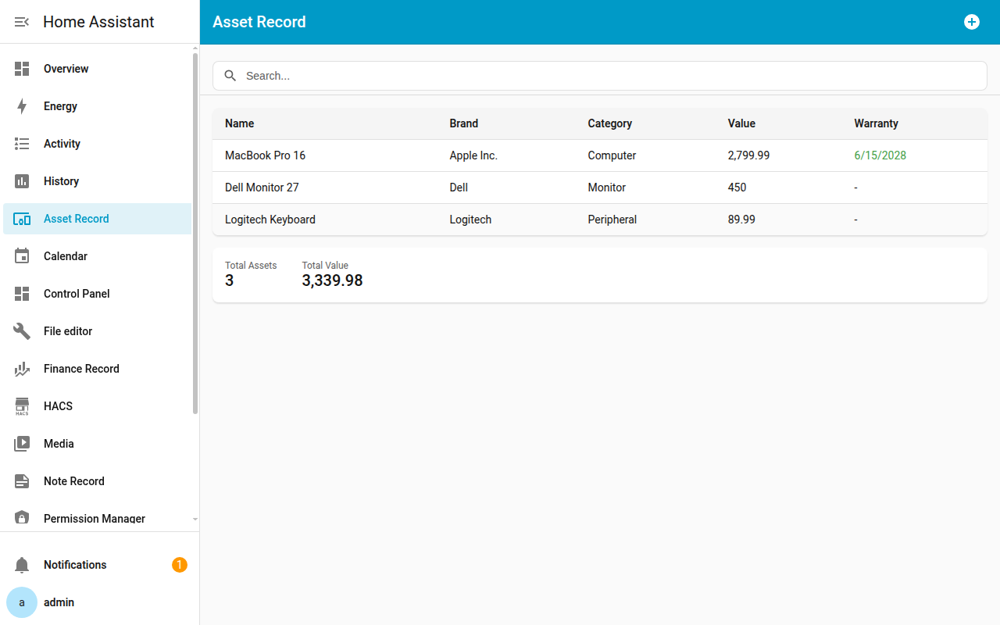
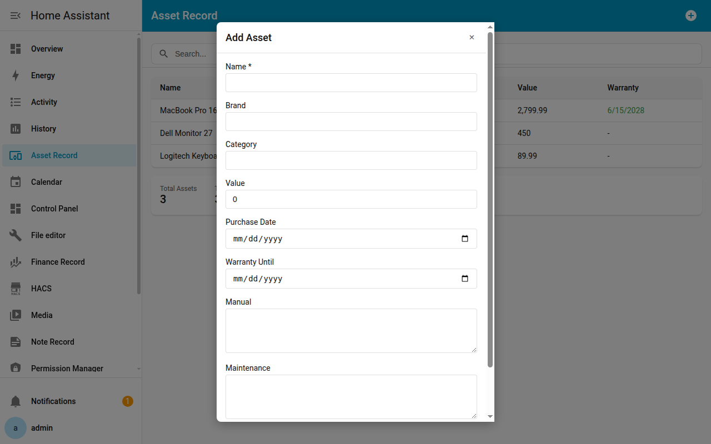
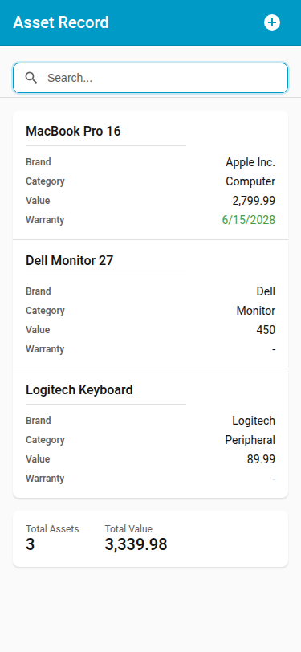

[English](README.md) | **繁體中文**

# Ha Asset Record

一個用於管理和追蹤家中資產的 Home Assistant 自訂元件，包括家電、電子產品及其他有價物品。

## 功能特色

- **資產管理儀表板**：美觀的側邊欄面板，方便管理所有資產
- **追蹤關鍵資訊**：
  - 名稱、品牌、類型
  - 購買時間與價值
  - 保固到期追蹤
  - 使用說明與維修說明（支援 Markdown）
- **保固提醒**：已過期或即將到期的保固會以視覺指示標示
- **搜尋與篩選**：依名稱、品牌或類型快速搜尋資產
- **多語系支援**：英文及繁體中文（zh-Hant）
- **Home Assistant 整合**：每筆資產會建立可用於自動化的實體

## 螢幕截圖

| 主面板 | 新增/編輯對話框 |
|:---:|:---:|
|  |  |

| 行動裝置檢視 | 搜尋篩選 |
|:---:|:---:|
|  |  |

## 安裝方式

### HACS（推薦）

1. 在 Home Assistant 中開啟 HACS
2. 點擊右上角的三個點，選擇「Custom repositories」
3. 新增此儲存庫網址：`https://github.com/WOOWTECH/ha_asset_record`
4. 類別選擇「Integration」
5. 點擊「Add」
6. 搜尋「Ha Asset Record」並安裝
7. 重新啟動 Home Assistant

### 手動安裝

1. 從 `custom_components` 目錄下載 `ha_asset_record` 資料夾
2. 複製到您的 Home Assistant `custom_components` 目錄
3. 重新啟動 Home Assistant

## 設定

1. 前往 **設定** > **裝置與服務**
2. 點擊 **+ 新增整合**
3. 搜尋「Ha Asset Record」
4. 依照設定精靈完成設定

## 使用方式

安裝完成後，Home Assistant 側邊欄會出現「Asset Record」面板。您可以：

1. **新增資產**：點擊「+」按鈕新增資產
2. **編輯資產**：點擊表格中的任一資產以編輯其詳細資訊
3. **刪除資產**：在編輯對話框中使用刪除按鈕
4. **搜尋**：使用搜尋列依名稱、品牌或類型篩選資產

## 系統需求

- Home Assistant 2025.12.0 或更新版本

## 支援

如遇到任何問題或有功能建議，請[開啟 Issue](https://github.com/WOOWTECH/ha_asset_record/issues)。

## 授權條款

本專案採用 [GPL-3.0 授權條款](LICENSE)。
